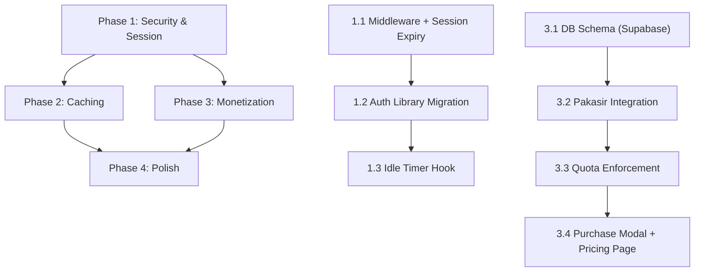

# 🚀 Invia — Go Public & Monetization Roadmap

After deeply analyzing your codebase, current architecture, and market positioning, here's my comprehensive product strategy and technical implementation plan to make **Invia** a production-ready, revenue-generating SaaS product.

---

## Current State Assessment

| Area | Status | Risk |
|------|--------|------|
| Auth | Supabase Auth, **no middleware** — no server-side route protection | 🔴 Critical |
| Session | No expiry configured — sessions stay alive indefinitely | 🔴 Critical |
| Security | No CSRF, no rate limiting, no input sanitization on public routes | 🟡 Medium |
| Caching | No caching layer — every page hit queries Supabase directly | 🟡 Medium |
| Monetization | None — unlimited invitations per account, no payment | 🔴 Critical (for revenue) |
| Templates | 6 templates, all free, no premium tier | 🟡 Medium |
| Public invite page | Works, RSVP works with Zod validation | 🟢 Good |
| Landing page | Beautiful, well-designed | 🟢 Good |

---

## Proposed Changes — Phased Approach

### 🔒 Phase 1: Security & Session Hardening (Must-Have Before Public)

#### 1.1 Auto-Logout / Session Expiry

> [!IMPORTANT]
> Your Supabase session currently never expires on the client side. This is a real security risk for a public product.

**Implementation:**
- Create `src/middleware.ts` to intercept all requests and refresh/validate Supabase sessions server-side
- Configure Supabase session to expire after **4 hours of inactivity**
- Add a client-side idle timer that warns users 5 minutes before logout
- On expiry → redirect to `/login` with a `?expired=true` toast message

#### [NEW] `src/middleware.ts`
- Next.js middleware using `@supabase/ssr` (replacing the deprecated `@supabase/auth-helpers-nextjs`)
- Validates session on every request to `/dashboard`, `/editor`, and other protected routes
- Sets `maxAge` cookie option for 4-hour session window
- Refreshes tokens automatically if session is still valid

#### [MODIFY] `src/lib/supabase/client.ts` & `src/lib/supabase/server.ts`
- Migrate from deprecated `@supabase/auth-helpers-nextjs` to `@supabase/ssr`
- Configure auth options with `autoRefreshToken` and session expiry

#### [NEW] `src/hooks/useIdleTimer.ts`
- Client-side hook that tracks user activity (mouse, keyboard, scroll)
- Shows a warning modal at 3h 55m: "Your session will expire in 5 minutes"
- Auto-signs out at 4 hours of inactivity

---

#### 1.2 Route Protection

#### [NEW] `src/middleware.ts` (combined with 1.1)
- Protect all `/dashboard/*` and `/editor/*` routes server-side
- Redirect unauthenticated users to `/login`
- Currently auth check only happens client-side in the dashboard `useEffect`, which flashes content before redirecting

---

### ⚡ Phase 2: Performance — Redis Caching

> [!NOTE]
> Since you're on Vercel, the most practical caching approach uses **Vercel KV (powered by Upstash Redis)**. This gives you Redis without managing infrastructure, and integrates natively with your Vercel deployment.

#### 2.1 What to Cache

| Data | TTL | Rationale |
|------|-----|-----------|
| Template list | 1 hour | Templates rarely change, but queried on every dashboard load |
| Public invitation data | 5 minutes | High-traffic: every guest who opens an invite link hits Supabase |
| User profile/quota | 10 minutes | Checked on every dashboard load and template selection |

#### 2.2 Implementation

#### [NEW] `src/lib/cache.ts`
- Abstraction layer over Vercel KV / Upstash Redis
- `cacheGet<T>(key) → T | null`
- `cacheSet(key, value, ttlSeconds)`
- `cacheInvalidate(key | pattern)`
- Falls back gracefully if Redis is unavailable (no hard dependency)

#### [MODIFY] `src/app/actions.ts`
- After RSVP submit, invalidate the invitation cache

#### [NEW] Server-side data fetching with cache
- Template list fetched server-side with 1-hour cache
- Public invite pages use cached invitation data

#### Environment Variables (new)
```
KV_REST_API_URL=...
KV_REST_API_TOKEN=...
```

---

### 💰 Phase 3: Monetization — Freemium Model + Pakasir Payment

> [!IMPORTANT]
> This is the revenue engine. The model: **1 free invitation per account, Rp10.000 per additional template usage.**

#### 3.1 Database Schema Changes (Supabase)

New table: **`user_quotas`**
| Column | Type | Description |
|--------|------|-------------|
| `id` | uuid (PK) | |
| `user_id` | uuid (FK → auth.users) | |
| `free_quota` | integer | Default: 1 |
| `purchased_quota` | integer | Default: 0 |
| `created_at` | timestamp | |
| `updated_at` | timestamp | |

New table: **`transactions`**
| Column | Type | Description |
|--------|------|-------------|
| `id` | uuid (PK) | |
| `user_id` | uuid (FK → auth.users) | |
| `order_id` | text (unique) | e.g., `INV-{timestamp}-{random}` |
| `amount` | integer | 10000 |
| `status` | text | `pending` / `completed` / `cancelled` / `expired` |
| `payment_method` | text | `qris`, `bni_va`, etc. |
| `pakasir_payment_number` | text | QR string or VA number |
| `expired_at` | timestamp | |
| `completed_at` | timestamp | |
| `created_at` | timestamp | |

#### 3.2 Pakasir Integration

> Using the **Pakasir Node.js SDK** (`pakasir-sdk`) for clean server-side integration.

#### [NEW] `src/lib/pakasir.ts`
- Initialize Pakasir SDK with slug and API key from env vars
- Helper functions: `createPaymentTransaction()`, `checkTransactionStatus()`, `cancelTransaction()`

#### [NEW] `src/app/api/payment/create/route.ts`
- Server-side API route to create a payment via Pakasir API
- Generates unique `order_id`
- Returns QRIS string/VA number to client
- Saves transaction to `transactions` table with status `pending`

#### [NEW] `src/app/api/payment/webhook/route.ts`
- Webhook endpoint that Pakasir calls when payment is completed
- Validates `amount` and `order_id` match
- Updates `transactions.status` to `completed`
- Increments `user_quotas.purchased_quota` by 1
- Returns 200 OK

#### [NEW] `src/app/api/payment/status/route.ts`
- Polling endpoint for client to check payment status
- Falls back to Pakasir Transaction Detail API for validation

#### Environment Variables (new)
```
PAKASIR_SLUG=your-project-slug
PAKASIR_API_KEY=your-api-key
```

#### 3.3 Quota Enforcement

#### [MODIFY] `src/app/(app)/dashboard/page.tsx`
- Before allowing "Use Template" action, check quota:
  - `free_quota + purchased_quota > current_invitation_count` → allow
  - Otherwise → show **Purchase Modal**
- Show quota usage in stats: "1/1 Free Used" or "3/5 Total"

#### [NEW] `src/components/PurchaseModal.tsx`
- Beautiful modal showing:
  - "You've used your free invitation!"
  - Price: **Rp10.000** per additional template
  - Payment method selector (QRIS recommended as default, with VA options)
  - QR code display (using `qrcode.react` you already have!)
  - Real-time status polling
  - Success animation → redirect to template editor

#### [NEW] `src/components/QuotaBar.tsx`
- Visual progress bar showing quota usage
- Displayed in sidebar and dashboard stats

#### 3.4 Pricing Page

#### [NEW] `src/app/pricing/page.tsx`
- Public pricing page linked from landing page
- Shows the freemium model clearly:
  - **Free Tier**: 1 invitation, all templates, RSVP tracking, QR sharing
  - **Pay-As-You-Go**: Rp10.000 per additional invitation
- Trust signals: "Pembayaran aman via Pakasir (QRIS & Virtual Account)"

---

### 🎨 Phase 4: Polish for Public Launch (Nice-to-Have)

These items improve user trust and conversion but can come after initial launch:

| Feature | Priority | Notes |
|---------|----------|-------|
| Terms of Service & Privacy Policy pages | High | Required for any public product |
| Email notifications (RSVP alerts) | Medium | Can use Supabase Edge Functions + Resend |
| Custom domain per invitation | Low | Premium feature for future |
| Analytics dashboard (RSVP charts) | Medium | Show opened, confirmed, declined stats |
| SEO meta tags for invite pages | High | Open Graph tags so invitations look great when shared |
| Rate limiting on public endpoints | High | Prevent RSVP spam on `/invite/[id]` |

---

## Open Questions

> [!IMPORTANT]
> **Pakasir Account**: Have you already created a Pakasir account and project? I'll need the **Slug** and **API Key** from your Pakasir project dashboard to configure the integration. Also, should we start in **Sandbox mode** for testing?

> [!IMPORTANT]
> **Redis/Caching Provider**: For Redis caching, do you want to use:
> - **Vercel KV** (easiest if you're on Vercel — managed Upstash Redis, ~$0 for 3K commands/day free tier)
> - **Upstash Redis directly** (free tier: 10K commands/day)
> - **Skip Redis for now** and use Next.js built-in `unstable_cache` / `revalidate` (zero cost, simpler, still effective)
>
> My recommendation: Start with **Next.js built-in caching** (free, no extra infra) and add Redis later only if you hit performance limits.

> [!IMPORTANT]
> **Session Timeout**: You mentioned "several hours" — I'm proposing **4 hours** of inactivity. Is that acceptable, or do you prefer a different duration (e.g., 2 hours, 8 hours)?

> [!WARNING]
> **Supabase Auth Library Migration**: Your project currently uses `@supabase/auth-helpers-nextjs` which is **deprecated**. The session management fix requires migrating to `@supabase/ssr`. This is a necessary change for proper session handling, but it touches your auth layer.

---

## Execution Order



I recommend executing **Phase 1 first** (security is non-negotiable before going public), then **Phase 3** (monetization — the revenue driver), then Phase 2 and 4 in parallel.

---

## Verification Plan

### Automated Tests
- Test middleware redirects for unauthenticated users
- Test Pakasir webhook payload validation
- Test quota enforcement logic
- `npm run build` to ensure no TypeScript errors

### Manual Verification
- Login → wait 4+ hours → verify auto-logout
- Create 1 free invitation → verify quota shows "1/1"
- Try creating 2nd invitation → verify Purchase Modal appears
- Complete Pakasir Sandbox payment → verify quota increments
- Check invitation cache hit/miss with Redis logs

### Security Checklist
- [ ] No protected route accessible without auth
- [ ] Webhook validates payment amount and order_id
- [ ] API keys stored in env vars, never exposed client-side
- [ ] Rate limiting on RSVP and payment endpoints
